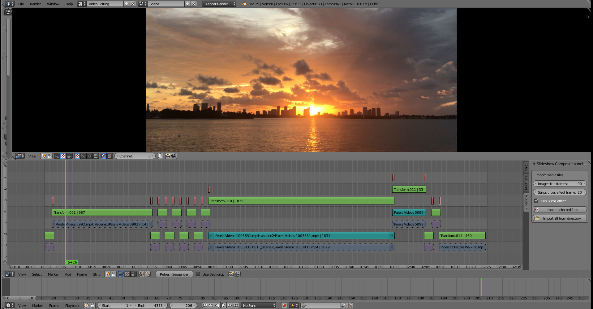

Blender Slideshow Composer
==========================

General information
-------------------
This is Blender plugin that can be used to generate slideshows consisted of images and videos. It uses [Ken Burns effect](https://en.wikipedia.org/wiki/Ken_Burns_effect) to make nice-looking transitions between imported slides. 

Can I use it for my project?
----------------------------
This plugin was created for my own needs of creating holiday family movies. I'm releasing the source code - do whatever you want with it. Any contribution to this repository is highly welcome :)   

How to use it
-------------
Once installed, the plugin adds a menu to import files to the VSE Movie Clip Editor.

Other options
--------------------
When using import option, transitions between strips are automatically generated. The generated transition can be changed for selected strip by using context menu. In order to add the context menu follow the steps:
1. Open up User Preferences -> Input tab
2. Expand Sequencer -> Sequencer (Global)
3. Create new Call Menu entry
5. Enter wm.call_menu in the first field
6. Enter slideshow_composer.main_menu as a name
7. Assign a key eg. Shift + Q

Used libraries and 3rd party code
---------------------------------
* https://github.com/JacquesLucke/code_autocomplete

Additional Tools
-----
In tools folder there is a script to prepare files before importing to VSE. Use it if you want to
* Stabilize video files, remove camera shaking (requires [ffmpeg](https://www.ffmpeg.org/))
* Fix aspect ratio of images (requires [imagemagick](https://www.imagemagick.org/))
