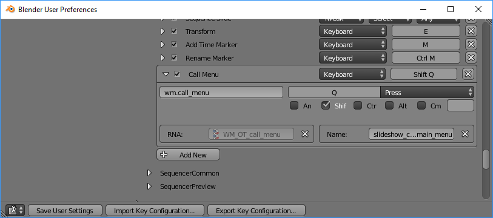

Blender Slideshow Composer
==========================

Create menu shortcut
--------------------

1. Open up User Preferences -> Input tab
2. Expand Sequencer -> Sequencer (Global)
3. Create new Call Menu entry
5. Enter wm.call_menu in the first field
6. Enter slideshow_composer.main_menu as a name
7. Assign a key eg. Shift + Q

